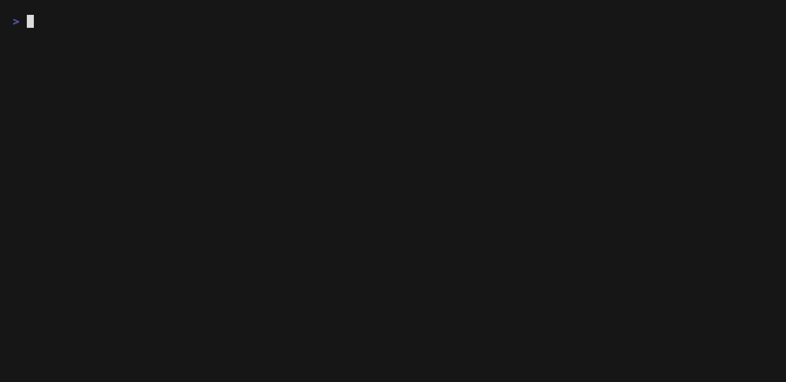

twatch
======

twatch - wrap a child TUI app and keep screen history.



## Description

`twatch` runs a TUI application inside a PTY, records screen changes, and lets
you move back through history later, similar to `hwatch`.

### Features

- Wrap a child TUI application in a PTY
- Keep `latest` plus screen history with checkpoint + delta storage
- Show history in an overlay pane
- Highlight changed cells in watch diff mode
- Filter history with string (`/`) or regex (`*`)
- Save and load history logs
- Save the selected snapshot as ANSI text or SVG
- Run an `aftercommand` hook when output changes
- Compress in-memory history with `-C`
- Output the current screen in batch mode
- Propagate terminal resize to both `twatch` and the child TUI

## Install

```bash
cargo build --release
```

## Usage

### Command

```text
$ twatch --help
TUI watch for terminal apps

Usage: twatch [OPTIONS] [COMMAND]...

Arguments:
  [COMMAND]...

Options:
  -n, --interval <INTERVAL>                        [default: 2]
  -b, --batch
  -A, --aftercommand <AFTERCOMMAND>
  -C, --compress
  -l, --logfile <LOGFILE>
      --screenshot-dir <SCREENSHOT_DIR>            [default: /tmp]
      --screenshot-format <SCREENSHOT_FORMAT>      [default: text] [possible values: text, svg]
  -s, --shell <SHELL>                              [default: "sh -c"]
  -d, --differences <DIFFERENCES>                  [default: none] [possible values: none, watch]
  -L, --limit <LIMIT>                              [default: 500]
      --checkpoint-interval <CHECKPOINT_INTERVAL>  [default: 12]
  -h, --help                                       Print help
  -V, --version                                    Print version
```

### Keybind

| Key | Action |
| --- | --- |
| `Up`, `Down` | Move selected screen (`history` or `watch`) |
| `PageUp`, `PageDown` | Move selected screen (`history` or `watch`) |
| `Home`, `End` | Move selected screen (`history` or `watch`) |
| `Tab` | Toggle selected screen (`history` / `watch`) |
| `Left` | Select watch screen |
| `Right` | Select history screen |
| `Alt+Left`, `Alt+Right` | Scroll watch window horizontally |
| `q` | Open exit dialog |
| `Ctrl-c` | Open exit dialog |
| `h` | Show help |
| `Backspace` | Toggle history pane |
| `d` | Toggle diff mode |
| `0` | Disable diff |
| `1` | Enable watch diff |
| `p` | Pause/unpause capture |
| `/` | Filter history by string |
| `*` | Filter history by regex |
| `i` | Enter child app input mode |
| `Ctrl-g` | Leave child app input mode |
| `D` | Delete selected history |
| `X` | Clear history except selected |
| `s` | Cycle snapshot format (`text(ANSI)` / `svg`) |
| `S` | Save selected snapshot |

## Configuration

### Logging output

```bash
twatch --logfile ./twatch.jsonl htop
```

### Batch mode

```bash
twatch -b htop
```

### Compression

```bash
twatch -C htop
```

### Snapshot output

```bash
twatch --screenshot-dir ./shots --screenshot-format svg htop
```

## Example

### Wrap `htop`

```bash
twatch htop
```

### Regex filter

```bash
twatch htop
# press *
```

## Related Projects

These projects explore similar terminal wrapping and history-oriented workflows.

- [hwatch](https://github.com/blacknon/hwatch): the history-focused watch tool that informs the search, diff, and navigation experience.
- [baeru](https://github.com/blacknon/baeru): an earlier TUI wrapper project based on the same core idea.
- [twrap](https://github.com/blacknon/twrap): the terminal wrapper foundation that inspired the PTY capture and replay model here.

## Notes

- Mouse support is implemented, but behavior still depends on the child TUI and
  the mouse protocol it enables.
- Snapshot save defaults to `/tmp`, and text output keeps ANSI color escapes.
