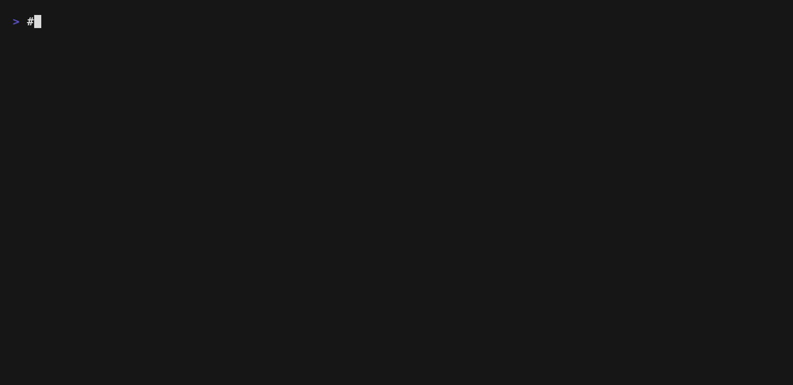

twatch
======

twatch - record, rewind, inspect, and diff terminal UI screens.

## Description

twatch adds rewindable history to existing TUI applications.

Full-screen terminal apps like htop, lazygit, k9s, and nmtui constantly redraw the same screen, so normal terminal scrollback often cannot show you what happened before.

twatch runs the target app through a PTY, records its screen states, and lets you rewind, search, and diff previous frames. It can also extract selected ranges in batch mode and write them to standard output, making TUI content easier to inspect, debug, or pipe into other commands.

### demo

#### TUI wrap mode


#### TUI wrap mode (using zsh)


#### TUI to Batch mode



### Features

- Wrap a child TUI application in a PTY
- Keep `latest` plus screen history with checkpoint + delta storage
- Show history in an overlay pane
- Highlight changed cells in watch diff mode
- Filter history with string (`/`) or regex (`*`)
- Inspect a selected cell and compare it with the previous frame
- Record input and resize context with frame metadata
- Save and load history logs
- Replay a saved JSONL trace in read-only mode
- Save the selected snapshot as ANSI text or SVG
- Auto-save snapshots on string, regex, or change-count triggers
- Run an asynchronous experimental `aftercommand` trigger
- Compress in-memory history with experimental `-C`
- Output the current screen in batch mode
- Propagate terminal resize to both `twatch` and the child TUI

## Install

```bash
cargo install twatch
```

## Usage

### Command

```text
$ twatch --help
watch for TUI apps

Usage: twatch [OPTIONS] [COMMAND]...

Arguments:
  [COMMAND]...

Options:
  -b, --batch

      --batch-count <BATCH_COUNT>
          Stop after emitting this many batch frames
      --batch-size <WIDTH,HEIGHT>
          Use a fixed PTY size such as 80,24
      --batch-crop <X,Y,WIDTH,HEIGHT>
          Crop batch output to a rectangle such as 10,5,40,12
      --batch-diff-only
          Print only added content for batch diff output
      --batch-no-color
          Disable ANSI color sequences in batch output
  -A, --aftercommand <AFTERCOMMAND>

  -K, --keymap <KEY=ACTION>
          Remap twatch keys with KEY=ACTION
  -k, --bind <FROM=TO>
          Override child TUI keys with FROM=TO
      --aftercommand-regex <AFTERCOMMAND_REGEX>
          Only run aftercommand when output matches this regex
      --aftercommand-change-cells <AFTERCOMMAND_CHANGE_CELLS>
          Only run aftercommand when changed cell count reaches this threshold
      --aftercommand-every <AFTERCOMMAND_EVERY>
          Only run aftercommand on every Nth changed frame
      --aftercommand-debounce-ms <AFTERCOMMAND_DEBOUNCE_MS>
          Debounce aftercommand for this many milliseconds
      --aftercommand-timeout-ms <AFTERCOMMAND_TIMEOUT_MS>
          Kill aftercommand if it exceeds this timeout in milliseconds [default: 3000]
  -C, --compress

  -l, --logfile <LOGFILE>

      --replay <REPLAY>
          Replay a saved JSONL trace in read-only mode
      --screenshot-dir <SCREENSHOT_DIR>
          [default: /tmp]
      --screenshot-format <SCREENSHOT_FORMAT>
          [default: text] [possible values: text, svg]
      --snapshot-on <SNAPSHOT_ON>
          Auto-save a snapshot when the screen contains this string
      --snapshot-on-regex <SNAPSHOT_ON_REGEX>
          Auto-save a snapshot when the screen matches this regex
      --snapshot-on-change-cells <SNAPSHOT_ON_CHANGE_CELLS>
          Auto-save a snapshot when changed cell count reaches this threshold
      --snapshot-once
          Only trigger automatic snapshot once
  -s, --shell <SHELL>
          [default: "sh -c"]
  -d, --differences <DIFFERENCES>
          Diff mode: watch for TUI mode, list/word for batch mode [default: none] [possible values: none, watch, list, word]
  -L, --limit <LIMIT>
          [default: 500]
      --checkpoint-interval <CHECKPOINT_INTERVAL>
          [default: 12]
      --debug
          Show debug diagnostics in the interactive UI
  -h, --help
          Print help
  -V, --version
          Print version
```

### Keybind

| Key | Action |
| --- | --- |
| `Up`, `Down` | Move selected screen (`history` or `watch`) |
| `PageUp`, `PageDown` | Move selected screen (`history` or `watch`) |
| `Home`, `End` | Move selected screen (`history` or `watch`) |
| `Tab` | Toggle selected screen (`history` / `watch`) |
| `Left` | Select watch screen |
| `Right` | Select history screen |
| `Alt+Left`, `Alt+Right` | Scroll watch window horizontally |
| `q` | Open exit dialog |
| `Ctrl-c` | Open exit dialog |
| `h` | Show help |
| `Backspace` | Toggle history pane |
| `d` | Toggle diff mode |
| `0` | Disable diff |
| `1` | Enable watch diff |
| `p` | Pause/unpause capture |
| `Shift+P` | Pause/unpause the child process |
| `I` | Toggle cell inspector |
| `Shift+Arrow` | Move inspector cursor |
| `/` | Filter history by string |
| `*` | Filter history by regex |
| `i` | Enter child app input mode |
| `Ctrl-g` | Leave child app input mode |
| `D` | Delete selected history |
| `X` | Clear history except selected |
| `s` | Cycle snapshot format (`text(ANSI)` / `svg`) |
| `Shift+S` | Toggle selected frame info |
| `Ctrl+S` | Save selected snapshot |

#### Custom keybind

Remap `twatch` actions with `-K/--keymap` using `KEY=ACTION`.
Custom keymaps are checked before the built-in passthrough rules, so you can
override keys such as `Down` and use them for local history navigation.

```bash
twatch -K ctrl-p=history_pane_up -K ctrl-n=history_pane_down htop
twatch -K down=history_pane_down htop
```

Supported actions:

| action | description |
| --- | --- |
| `up` / `down` | Move selected view using the current focus |
| `watch_pane_up` / `watch_pane_down` | Scroll only the watch pane |
| `history_pane_up` / `history_pane_down` | Move only the history selection |
| `page_up` / `page_down` | Page move using the current focus |
| `watch_pane_page_up` / `watch_pane_page_down` | Page scroll only the watch pane |
| `history_pane_page_up` / `history_pane_page_down` | Page move only the history pane |
| `move_top` / `move_end` | Jump using the current focus |
| `watch_pane_move_top` / `watch_pane_move_end` | Jump only the watch pane |
| `history_pane_move_top` / `history_pane_move_end` | Jump only the history selection |
| `toggle_focus` | Switch watch/history focus |
| `focus_watch_pane` / `focus_history_pane` | Focus a specific pane |
| `quit` | Open the exit dialog |
| `reset` | Close help/exit or clear the current filter |
| `delete` | Delete the selected history entry |
| `clear_except_selected` | Keep only the selected history entry |
| `cancel` | Match the built-in `Ctrl-c` behavior |
| `force_cancel` | Exit immediately |
| `help` | Toggle the help dialog |
| `toggle_view_history_pane` | Toggle the history pane |
| `toggle_history_summary` | Toggle selected frame details |
| `toggle_diff_mode` | Toggle watch diff |
| `set_diff_mode_none` | Disable diff |
| `set_diff_mode_watch` | Enable watch diff |
| `toggle_pause` | Pause or resume capture |
| `toggle_child_pause` | Pause or resume the wrapped process |
| `change_filter_mode` | Start plain-text history filtering |
| `change_regex_filter_mode` | Start regex history filtering |
| `enter_app_input_mode` | Enter child app input mode |
| `leave_app_input_mode` | Leave child app input mode |
| `toggle_inspector` | Toggle the cell inspector |
| `save_snapshot` | Save the selected snapshot |
| `cycle_snapshot_format` | Cycle snapshot output format |
| `scroll_left` / `scroll_right` | Scroll the watch pane horizontally |

#### Child key override

Override keys before they reach the wrapped TUI with `-k/--bind FROM=TO`.
This follows the `twrap` style: `TO` accepts key names like `up`, `down`,
`enter`, `f1`, `ctrl-c`, comma-separated key sequences, `text:...`, or
`screenshot`.

```bash
twatch -k j=down -k k=up lazygit
twatch -k ctrl-j=text:gg -k ctrl-t=screenshot nvim
```

`Ctrl-g` remains reserved for leaving app input mode.

### Notes

- Mouse support is implemented, but behavior still depends on the child TUI and
  the mouse protocol it enables.
- Snapshot save defaults to `/tmp`, and text output keeps ANSI color escapes.
- `p` pauses `twatch` screen capture and history updates.
- `Shift+P` suspends or resumes the wrapped child process.

## Example


### Wrap `htop`

Run a TUI application inside `twatch` and browse previous screen states later.
This is the basic interactive mode.

```bash
twatch htop
```

#### filter

Open plain search mode and narrow the history list to snapshots containing a
matching string.
Matches are highlighted on the watch screen while the filtered history entries
remain selectable in the history pane.

```bash
twatch htop
# press /
```

Open regex search mode and narrow the history list to matching snapshots.
Matching entries stay selectable from the history pane while you inspect changes.

```bash
twatch htop
# press *
```

### Batch mode

Stream the captured TUI as plain terminal text instead of opening the interactive UI.
You can combine this with count, crop, size, diff, and color controls.

```bash
twatch -b htop
```

#### Delete ANSI Color

Disable ANSI escape sequences and print plain text only.
This is useful when piping batch output into tools that do not handle colors well.

```bash
twatch -b --batch-no-color htop
```

#### Set terminal size, and cropped range　

Use a fixed PTY size when you want stable batch output across runs.
You can also crop a rectangular region to focus on one part of the captured screen.

```bash
twatch --batch-size 80,20 btop
```

```bash
twatch --batch-size 80,20 --batch-crop 0,10,80,10 -b htop
```

#### Line/Word diff

For text-oriented commands, you can switch to `line` or `word` diff mode to get [hwatch](https://github.com/blacknon/hwatch)-like highlighting.
This works best in batch mode, where twatch compares plain text snapshots instead of the live TUI screen buffer.

```bash
twatch --batch --differences line htop
```

```bash
twatch --batch --differences word kubectl get pods -A
```

### Logging output

Save captured snapshots as JSONL so you can reload or inspect a session later.
This is useful for debugging long-running screens outside the live UI.

```bash
twatch --logfile ./twatch.jsonl htop
```

### Replay mode

Open a saved JSONL trace without launching a child PTY.
This is useful for issue reports or postmortem debugging.

```bash
twatch --replay ./twatch.jsonl
```

### Aftercommand

Run a shell hook asynchronously when debug-relevant trigger conditions match.
You can limit it with regex, change count, cadence, debounce, and timeout options.

```bash
twatch -A 'jq -r .output <<<"$TWATCH_DATA" >/tmp/twatch.out' \
  --aftercommand-regex 'panic|error' \
  --aftercommand-debounce-ms 500 \
  htop
```

`TWATCH_DATA` includes frame metadata such as:

- `frame_seq`
- `unix_timestamp`
- `width`
- `height`
- `changed_cell_count`
- `matched_rules`
- `last_input_summary`

### Automatic snapshot trigger

Save snapshots automatically when a frame matches a string, regex, or change-count threshold.

```bash
twatch --snapshot-on 'panic' --snapshot-once htop
```

```bash
twatch --snapshot-on-regex 'panic|traceback' --snapshot-on-change-cells 100 htop
```

### Compression

Compress stored history entries in memory to reduce runtime footprint.
This is still experimental.
It is most helpful when the wrapped TUI updates frequently.

```bash
twatch -C htop
```

### Snapshot output

Save the selected screen as ANSI text or SVG from the interactive view.
Use this when you want a shareable artifact of one captured frame.

```bash
twatch --screenshot-dir ./shots --screenshot-format svg htop
```

## Related Projects

These projects explore similar terminal wrapping and history-oriented workflows.

- [hwatch](https://github.com/blacknon/hwatch): the history-focused watch tool that informs the search, diff, and navigation experience.
- [baeru](https://github.com/blacknon/baeru): an earlier TUI wrapper project based on the same core idea.
- [twrap](https://github.com/blacknon/twrap): the terminal wrapper foundation that inspired the PTY capture and replay model here.
